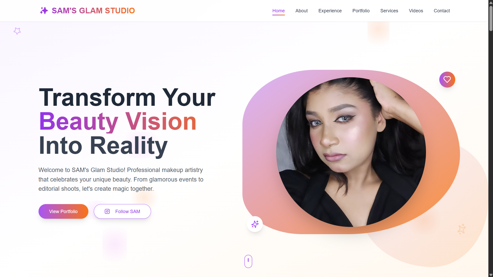
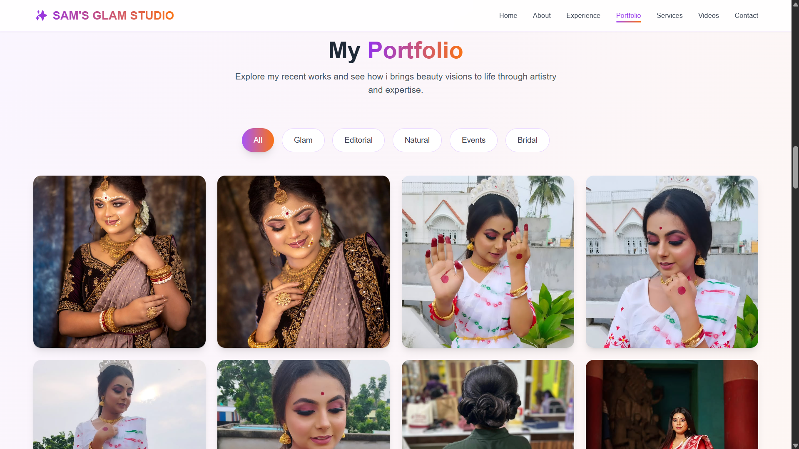
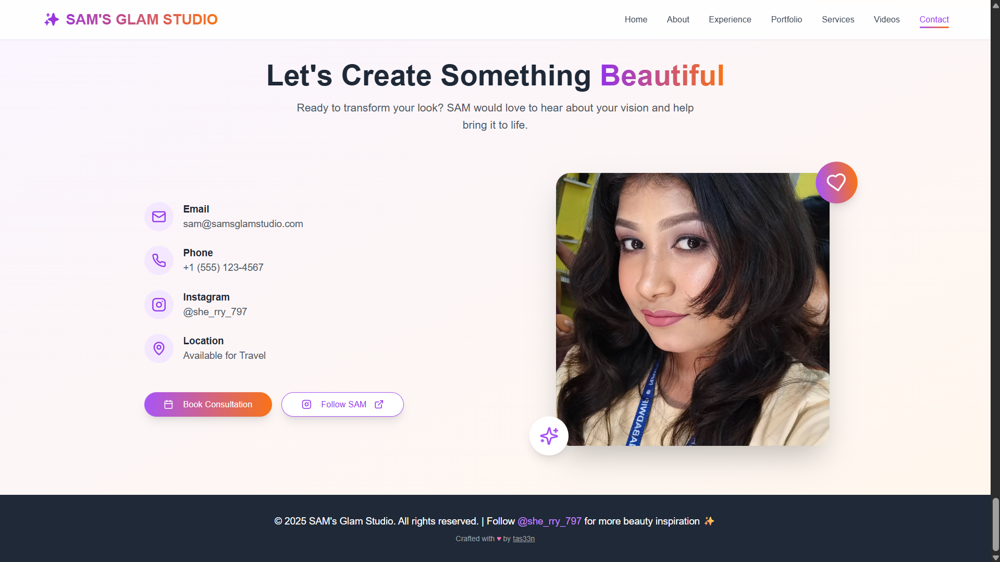

# SAM'S GLAM STUDIO

Welcome to **SAM'S GLAM STUDIO**! This is a modern, visually stunning single-page application (SPA) for professional makeup artists to showcase their portfolio, highlight services, and connect with clients. Built with Next.js, Framer Motion, and Tailwind CSS.

---

## 🚀 Features

- **Animated Hero Section:** Eye-catching introduction with smooth scroll and animated backgrounds.
- **Portfolio Gallery:** Filterable, modal-enabled gallery to showcase makeup artistry work.
- **Service Listings:** Detailed, interactive cards for all offered services.
- **Experience & Certifications:** Timeline and grid for professional journey, certifications, and achievements.
- **Video Carousel:** Social media video highlights with interactive navigation.
- **Contact Section:** Prominent contact info, social links, and call-to-action.
- **Responsive Design:** Fully optimized for mobile, tablet, and desktop.
- **Framer Motion Animations:** Smooth, modern UI transitions throughout.

---

## 🖼️ Previews

### Home Page

### Portfolio Gallery

### Contacts

---

## 👤 Author

- **tas33n** ([tas33n.is-a.dev](http://tas33n.is-a.dev))
- 📧 Email: [farhanisteak84@gmail.com](mailto:farhanisteak84@gmail.com)

---

## 📦 Installation & Usage

This project is currently not open for public deployment or contribution. For business inquiries or demo access, please contact the author.

---

## 📧 Contact

For questions, collaborations, or demo requests, please email: [farhanisteak84@gmail.com](mailto:farhanisteak84@gmail.com)

---

## 📄 License

All rights reserved. Unauthorized copying or distribution of any part of this project is prohibited.
